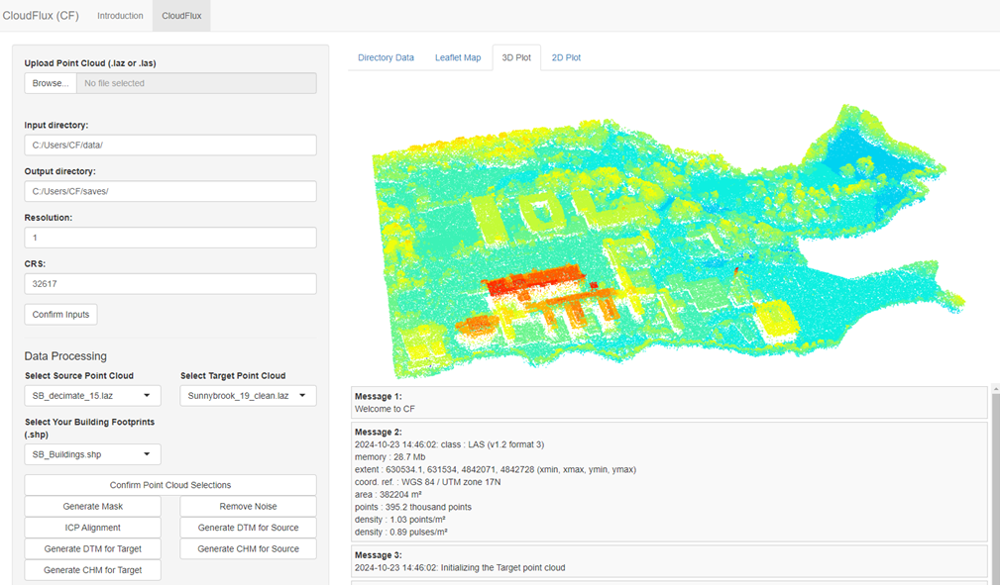
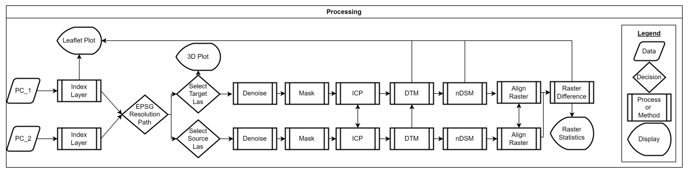

# CloudFlux 

CloudFlux is a specialized R package and Shiny application designed for the visualization, processing, and change detection of LiDAR point clouds. Built on a hybrid architecture, it leverages CFCore for heavy-duty spatial computations and CUDA-accelerated Python for rapid ICP (Iterative Closest Point) alignment.

 

# Methodological Workflow 

CloudFlux follows a rigorous processing pipeline to ensure high-accuracy change detection between multi-temporal datasets.

 

# Key Features

Automated Pre-processing: Specialized routines for denoising, building footprint masking, and ground classification to isolate vegetation and terrain.

Hybrid ICP Alignment: A high-performance registration engine that seamlessly switches between CPU (Open3D) and GPU (Cupoch) routines for multi-temporal point cloud registration.

Raster Generation: Creation of high-resolution Digital Terrain Models (DTM) and normalized Digital Surface Models (nDSM) using artifact-free "hole-filling" logic.

Change Detection: Tools to interactively classify and map canopy height and terrain changes over time, providing immediate spatial insights.

# Installation
You can install the development versions of both the engine (CFCore) and the interface (CloudFlux) from GitHub:

``` r
Install devtools if you haven't already
if (!require("devtools")) install.packages("devtools")

Install the backend engine
devtools::install_github("cscarpon/CFCore")

Install the frontend application
devtools::install_github("cscarpon/CloudFlux")
```

# Initial Setup (Python Environment)
CloudFlux requires a specific Conda environment (icp_conda) to handle GPU-accelerated tasks. After installing the package, run the following helper function to automatically configure your toolchain:

``` r

library(CloudFlux)

This will create the conda environment and install Open3D, Cupoch, and Laspy
setup_cloudflux_python()
```

# Run the Application
Once the setup is complete, you can launch the interactive GUI:

``` r
CloudFlux::run_app()
```

# About the Project
This package is part of a research initiative at the University of Toronto, focused on making advanced LiDAR change detection accessible to ecologists, foresters, and land managers.

Current Version: 0.1.0.0000

Last Compiled: ``` r Sys.time() ```

Package Status
``` r
devtools::check(quiet = TRUE)
#> 0 errors ✔ | 0 warnings ✔ | 0 notes ✔
```
